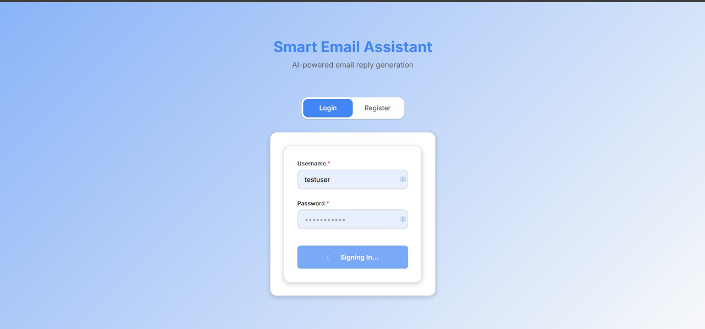
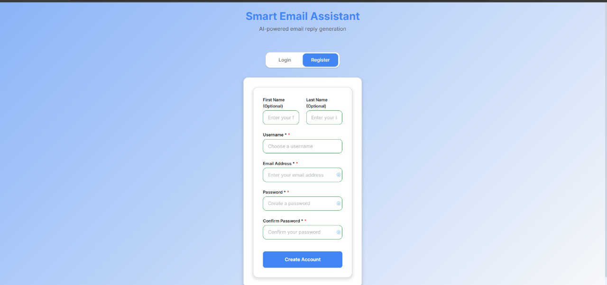
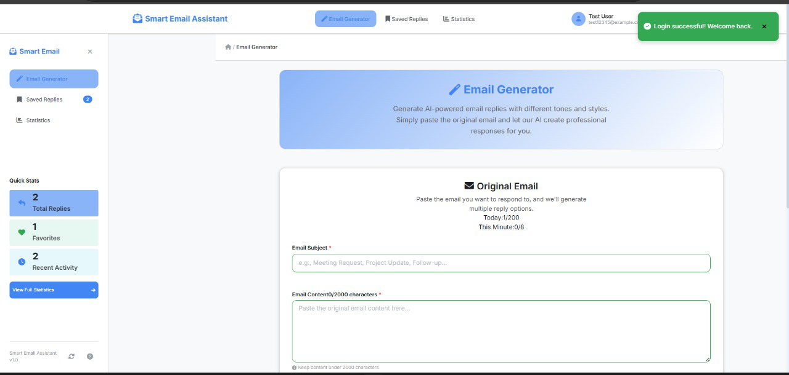
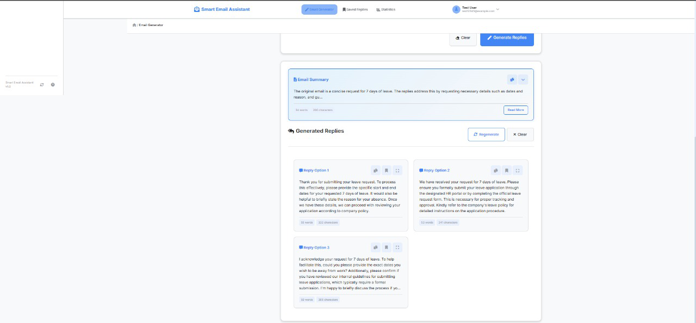
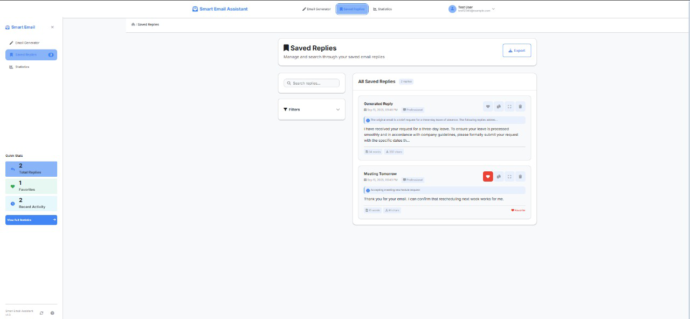
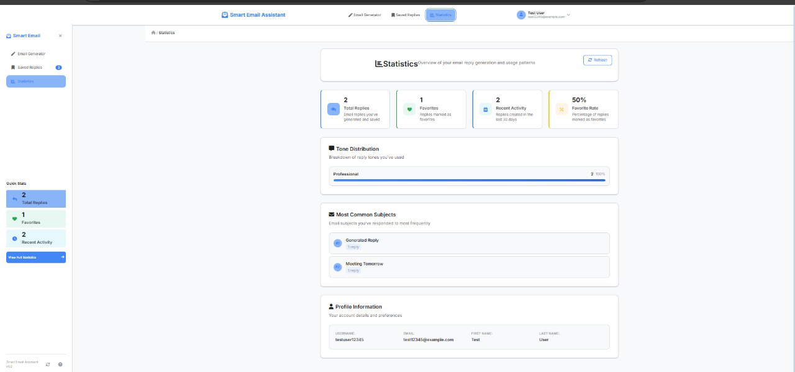
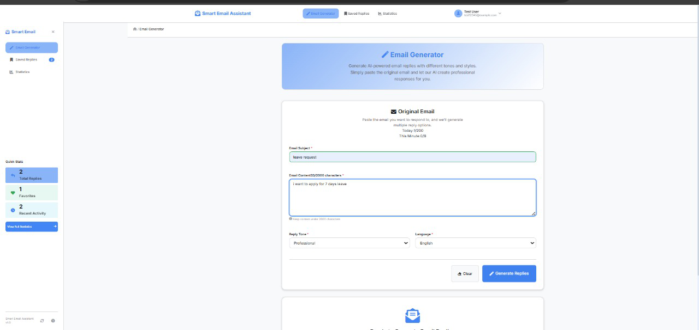

# 📧 Smart Email Assistant  

[](https://www.oracle.com/java/)  
[](https://spring.io/projects/spring-boot)  
[](https://reactjs.org/)  
[](https://www.postgresql.org/)  
[](LICENSE)  

An **AI-powered email assistant** that helps you **write, summarize, and customize email replies** with different tones. Built with **Spring Boot (Backend)** and **React (Frontend)**.  

---

## 🔗 Live Demo  

🌍 **Frontend App**: [Smart Email Assistant (Deployed)](https://frontend-page-adkl.onrender.com/)  

---

## ✨ Features  

- 🤖 AI-Powered Reply Generation – Smart suggestions for professional and casual emails  
- 📝 Email Summarization – Quickly condense long emails into short summaries  
- 🎭 Tone Selection – Choose between Formal, Casual, or Friendly  
- 📋 Copy-to-Clipboard – One-click copy for generated responses  
- 📱 Responsive UI – Works across desktop and mobile  

---

## 🛠 Tech Stack  

### Backend  
- Java 24  
- Spring Boot 3.5.5 (WebFlux, Security, Lombok)  
- **PostgreSQL** (Render Cloud Database)  
- JWT Authentication  
- Maven  

### Frontend  
- React 18  
- Axios for API calls  
- CSS (custom styling)  

---

## 🚀 Getting Started  

### Backend Setup  

```bash
cd Backend/email-writer-backend
mvn spring-boot:run
# Runs on http://localhost:8081
```

### Frontend Setup  

```bash
cd Frontend
npm install
npm start
# Runs on http://localhost:3000
```

---

## 🌐 Deployment  

- **Platform**: [Render](https://render.com/)  
- **Database**: PostgreSQL (Managed instance on Render)  
- **Environment Variables**:  
  - DB_URL  
  - DB_USERNAME  
  - DB_PASSWORD  
  - JWT_SECRET  
  - GEMINI_API_KEY  

---

## 📸 Screenshots  

### 🔹 Login & Registration  
  
  

### 🔹 Email Generator  
  
  

### 🔹 Saved Replies  
  

### 🔹 Statistics Dashboard  
  

### 🔹 Email Input  
  

---

## 📌 Roadmap  

- ✅ JWT-based Authentication (Login/Register)  
- ✅ PostgreSQL Database Integration  
- 🔲 Multiple reply options + history  
- 🔲 Dark Mode UI  
- 🔲 Multi-language support  

---

## 🤝 Contributing  

1. Fork the repo  
2. Create a feature branch (`git checkout -b feature-name`)  
3. Commit changes (`git commit -m "Add feature"`)  
4. Push to branch (`git push origin feature-name`)  
5. Open a Pull Request  

---

## 👨‍💻 Author  

**Lakshaya Jain**  
📌 B.Tech Final Year – CSE  

---

## 📄 License  

This project is licensed under the [MIT License](LICENSE).  
